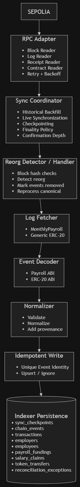

# WTF — Indexer Architecture

## 1. What is the Indexer?

The Indexer is a service that **reads blockchain data, processes it, and stores an indexed version** so the application can use it easily.

```text
Sepolia
   ↓
RPC
   ↓
Indexer
   ↓
PostgreSQL
```

## 2. What the Indexer Does

- Reads blocks and logs from Sepolia
- Processes `MonthlyPayroll` events
- Supports generic ERC-20 events
- Handles historical backfill
- Continuously processes new finalized blocks
- Decodes and normalizes events
- Tracks transactions
- Saves checkpoints
- Prevents duplicate records
- Retries failed RPC calls
- Handles blockchain reorganizations

## 3. Current Configuration

### Network

```text
Sepolia
```

### Payroll Contract

```text
0x25a2aa23067B7cF5a991fC56cF76E8BFE03Cc6eC
```

### ERC-20

The WTF token address is not currently established.

Use a **configurable generic ERC-20 address** for development.

## 4. Simple Architecture




## 5. Main Parts

### RPC Adapter
Talks to the blockchain.

- Blocks
- Logs
- Transactions
- Receipts
- Contract reads
- Retry + backoff

### Sync Coordinator
Controls:

- Backfill
- Live sync
- Confirmation depth
- Checkpoints

### Decoder
Converts raw blockchain logs into readable events.

### Normalizer
Validates and prepares events before saving them.

### Reorg Handler
Detects blockchain reorganizations and corrects affected data.

### Persistence
Provides the storage boundary for indexed data.

## 6. Events We Track

### Payroll

```text
EmployerAdded
EmployerRemoved
EmployeeAdded
EmployeeRemoved
PayrollFunded
SalaryClaimed
```

### ERC-20

```text
Transfer
Approval
```

## 7. Important Safety Rules

### No duplicates

Each event is identified by:

```text
chain_id
+ contract_address
+ transaction_hash
+ log_index
```

### Checkpoint only after successful processing

```text
Fetch → Process → Save → Checkpoint
```

Never checkpoint data that was not successfully saved.

### RPC failure

```text
Failure → Retry → Backoff → Retry
```

Never silently skip blocks.

### Reorg

```text
Detect → Mark old data → Process canonical chain
```

## 8. One-Line Definition

> **The WTF Indexer reads Sepolia blockchain activity, processes payroll and ERC-20 events, saves them reliably, and keeps track of blockchain changes without losing or duplicating data.**
