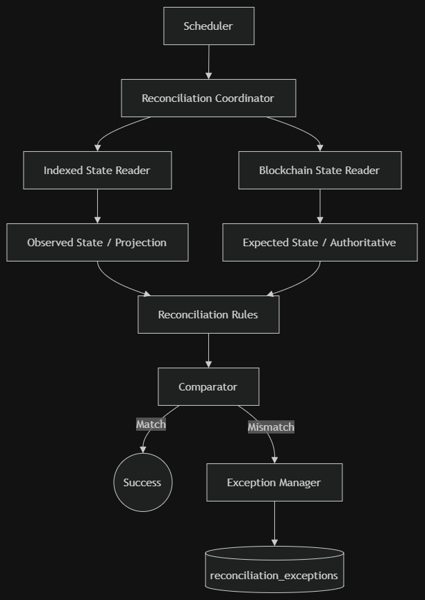

# WTF — Reconciliation Worker

## 1. What is Reconciliation?

Reconciliation is the **safety check** for the system.

It compares:

```text
Blockchain = Expected / Authoritative
Database   = Observed / Indexed
```

If they don't match, it creates an exception.

> **It checks the Indexer. It is not a second Indexer.**

## 2. Simple Flow



## 3. What It Checks

- Missing events
- Duplicate events
- Payroll consistency
- Token movements
- Balances
- Transaction status
- Reorg-related inconsistencies

## 4. Expected vs Observed

For a balance check:

```text
Blockchain / Contract Read
        ↓
EXPECTED BALANCE
        │
        │ Compare
        ▼
OBSERVED BALANCE
        ↑
        │
Indexed Database
```

**Expected** comes from the blockchain/contract.

**Observed** comes from indexed database data.

Do not treat an event-based calculation as authoritative when the contract provides a direct read.

## 5. Block Height Matters

Always try to compare data at the **same block**.

```text
Block N
 ├── Contract state @ N
 └── Indexed state @ N
          ↓
        Compare
```

If the database is behind the blockchain, it may simply be **indexing lag**, not an error.

## 6. Missing Events

Compare blockchain logs with indexed events:

```text
Blockchain Event
      ↓
Find in Database?
   ↙        ↘
 Yes        No
  ↓          ↓
 OK     Missing Event
```

The reconciliation worker should report the missing event, not become responsible for normal indexing.

## 7. Reconciliation Runs

Use two strategies:

### Recent Window

Frequently check recent blocks.

```text
Latest Block
     ↓
Recent Block Window
```

### Full Sweep

Slowly check older history using a cursor.

```text
0 → 10k → 20k → 30k → ...
```

This avoids scanning the entire blockchain every time.

## 8. Run vs Exception

These are different:

```text
Run
→ How far has reconciliation progressed?

Exception
→ What mismatch was found?
```

If the worker stops halfway, it should resume using its reconciliation cursor.

## 9. Exception Lifecycle

```text
Detected
   ↓
Open
   ↓
Rechecked
  ↙     ↘
Still    Fixed
Open    Resolved
```

The same mismatch should not create a new exception every time the worker runs.

## 10. Failure vs Mismatch

Don't confuse system failures with data problems.

### System failure

```text
RPC down
Database down
Timeout
Worker crash
```

→ Retry/fail the run.

### Data mismatch

```text
Missing event
Wrong balance
Duplicate event
Wrong transaction state
```

→ Create a reconciliation exception.

## 11. Important Rules

- Blockchain/contract state is authoritative.
- Database data is the observed/indexed state.
- Prefer same-block comparisons.
- Account for indexing lag.
- Do not become a second indexer.
- Do not silently insert missing events.
- Keep reconciliation progress separate from indexer checkpoints.
- Make exception creation idempotent.
- Keep reorgs in mind.
- Preserve enough information to explain every mismatch.

## 12. Simple Definition

> **The Reconciliation Worker checks whether the data stored by our Indexer matches the actual blockchain state and reports anything that is missing, duplicated, or incorrect.**
