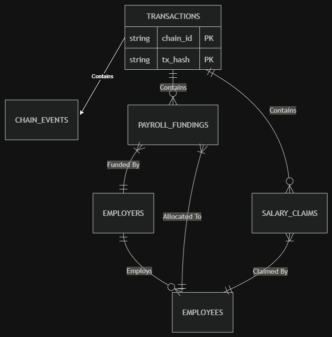

# WTF On-Chain Monitoring --- PostgreSQL Structure

## Database

``` text
wtf_onchain
```

The database stores blockchain events, transaction information, current
payroll state, payroll history, and reconciliation issues.

## Basic Schema


## Tables

### 1. `chain_events`

The main blockchain event ledger.

Stores: - Event type (`event_name`) - Chain and contract information -
Transaction hash, block number, timestamp, and log index - Raw event
data - Reorg status

**Unique event identity:**

``` text
(chain_id, contract_address, tx_hash, log_index)
```

------------------------------------------------------------------------

### 2. `transactions`

Stores blockchain transaction information and lifecycle status.

Key fields include: - `chain_id` - `tx_hash` - sender / recipient -
block information - gas used - transaction status -
confirmation/finalization information

**Primary key:**

``` text
(chain_id, tx_hash)
```

------------------------------------------------------------------------

### 3. `employers`

Stores the **current state** of employers.

Examples of stored information: - Wallet address - Available funds -
Total salary per second - Active/inactive status - Deactivation time

**Primary key:**

``` text
(chain_id, wallet)
```

------------------------------------------------------------------------

### 4. `employees`

Stores the **current state** of employees.

Examples of stored information: - Employee wallet - Employer - Salary
per second - Last withdrawal - Leave information - Active/inactive
status - Allocation

**Primary key:**

``` text
(chain_id, wallet)
```

------------------------------------------------------------------------

### 5. `payroll_fundings`

Stores **historical payroll funding events**.

Each `PayrollFunded` event creates a record containing: - Employer -
Employee - Amount paid - Fee - Amount credited - Transaction/block
information

------------------------------------------------------------------------

### 6. `salary_claims`

Stores **historical salary claim events**.

Each `SalaryClaimed` event creates a record containing: - Employee -
Amount claimed - Transaction/block information

------------------------------------------------------------------------

### 7. `reconciliation_exceptions`

Stores mismatches found during reconciliation.

Examples: - Expected value differs from observed blockchain value -
Unexpected employee/employer state - Balance mismatch

Stores the expected value, observed value, severity, status, and
detection/resolution times.

## Main Relationships

``` text
transactions
     │
     ├──────< chain_events
     ├──────< payroll_fundings
     └──────< salary_claims


employers
     │
     └──────< employees
                    │
                    ├──────< payroll_fundings
                    └──────< salary_claims
```

The foreign keys use `chain_id` together with the relevant transaction
or wallet identifier so the database remains chain-aware.

## Data Design Principles

### Current state vs history

``` text
Current state
├── employers
└── employees

Historical data
├── chain_events
├── payroll_fundings
└── salary_claims
```

`chain_events` preserves the blockchain event history, while `employers`
and `employees` provide an easy-to-query current projection.

### Solidity `uint256`

Large on-chain integer values such as payroll amounts are stored using:

``` text
NUMERIC(78,0)
```

This preserves the full `uint256` range.

### Blockchain metadata

The ABI defines event parameters, while blockchain/RPC data provides
metadata such as: - Transaction hash - Block number - Block timestamp -
Log index

## Current Status

The core PostgreSQL structure is created.

**Not covered yet:** - Database indexes - `sync_checkpoints` - WTF token
transfer table - Indexer implementation
